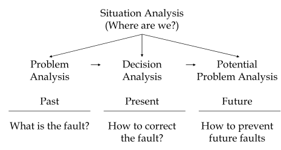

K-T Analysis tables
===================

Situation Analysis
------------------
=========== =================== ================ =============== =======================
Problems     Timing (H,M,L)     Trend (H,M,L)    Impact (H,M,L)  Process (PA,DA,or PPA)
=========== =================== ================ =============== =======================
1
2
3
...
=========== =================== ================ =============== =======================

After performing the decision analysis, state the order you are going to resolve the problems in.

(Note: the *Process* column is for the next step in dealing with that problem)

Problem Analysis
----------------

=========== ====== =========== ===========
x           Is     Is not      Distinction
=========== ====== =========== ===========
What
Where
When
Extent
=========== ====== =========== ===========

Probable cause = ....

Decision Analysis
-----------------
This is basically a concept selection matrix, but with the go/no go thing

============== ========== ========== ================ ========== ================
Alternative:              Idea1                       Idea2       
============== ========== ========== ================ ========== ================
*MUSTS:*
Saftey                      Go/NoGo                    Go/NoGo

*Wants:*       Weighting  Score/10   Weighted Score   Score/10   Weighted Score
1.
2.
3.
*Total Score* 
============== ========== ========== ================ ========== ================

Don't bother with the wants for an alternative that doesn't even check all the musts.

Potential Problem Analysis
--------------------------

===================== ================== ======================= ========================
Potential Problems    Possible Causes    Preventative actions    Contingency plan
===================== ================== ======================= ========================
A
B
C
===================== ================== ======================= ========================

Note that you can have more than one possible cause/preventative action per problem. 
The contingency plan is for what will you do if the problem does occour.

How they link together
----------------------

